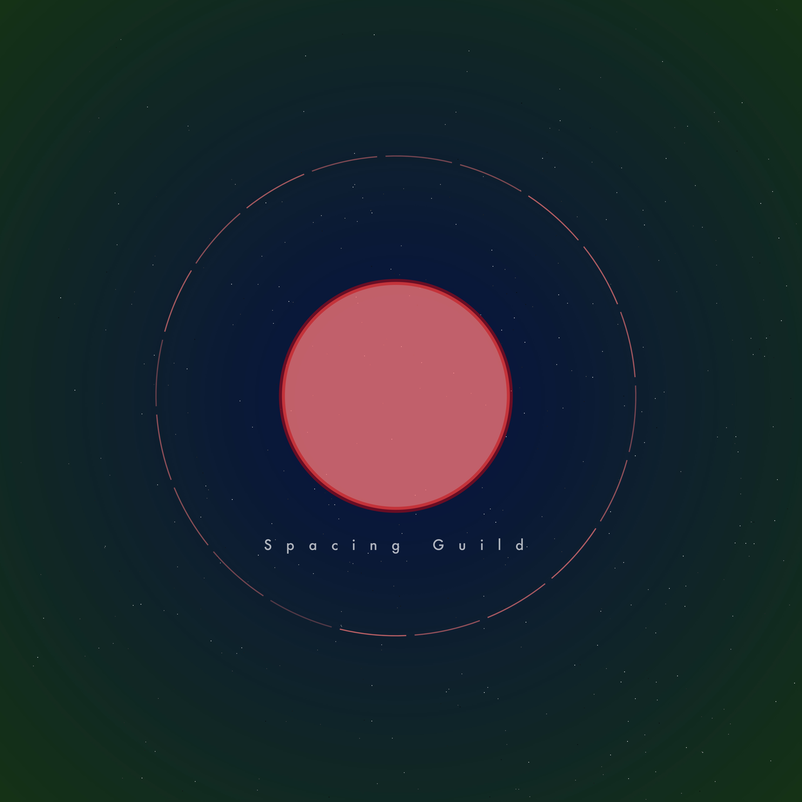

# Spacing Guild

In the year 13K trade between planets is controlled by the Spacing Guild. As a merchant of the Guild your job is to trade with the planets

At the start of the game the stellar map will show the systems under your control.

When visiting a planet, the prices of the goods will be shown.
The purchase of an asset is subject to the availability of credit and space in the cargo.

Game progress is saved automatically into browser storage.

