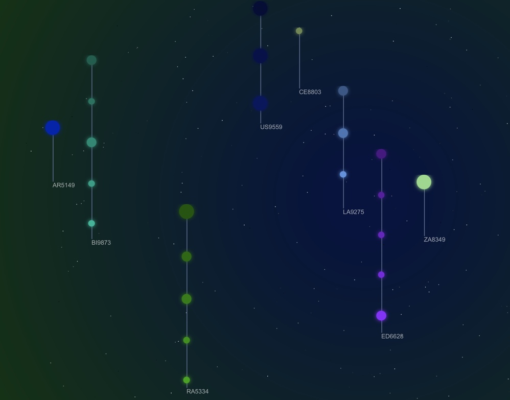
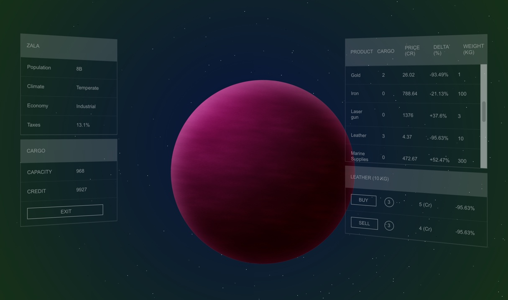

# Spacing Guild


In the year 13K trade between planets is controlled by the Spacing Guild. As a merchant of the Guild your job is to trade with the planets to obtain the maximum profit.

At the start of the game the stellar map will show the systems under your control.



To visit a planet just click on it.



The planet view shows, on the left side:
- Planet details: name, population, economy, climate and tax rate.
- Cargo details: credit and capacity.

on the right side:
- Trade table: show products/goods quotations.
- Product details: show how many products are available to buy/sell and prices.

A positive Delta price indicates an increased price over the guild's trade price, a negative one the opposite.
The purchase of an asset is subject to the availability of credit and space in the cargo.

Game progress is saved automatically into browser storage.

Shift click on the start page to generare a new sector.


# Install instructions
- Download or clone the repository
- Install dependencies:
```npm i ```

- run local server:
``` npm run dev```
- connect to:
```http://localhost:1234```


